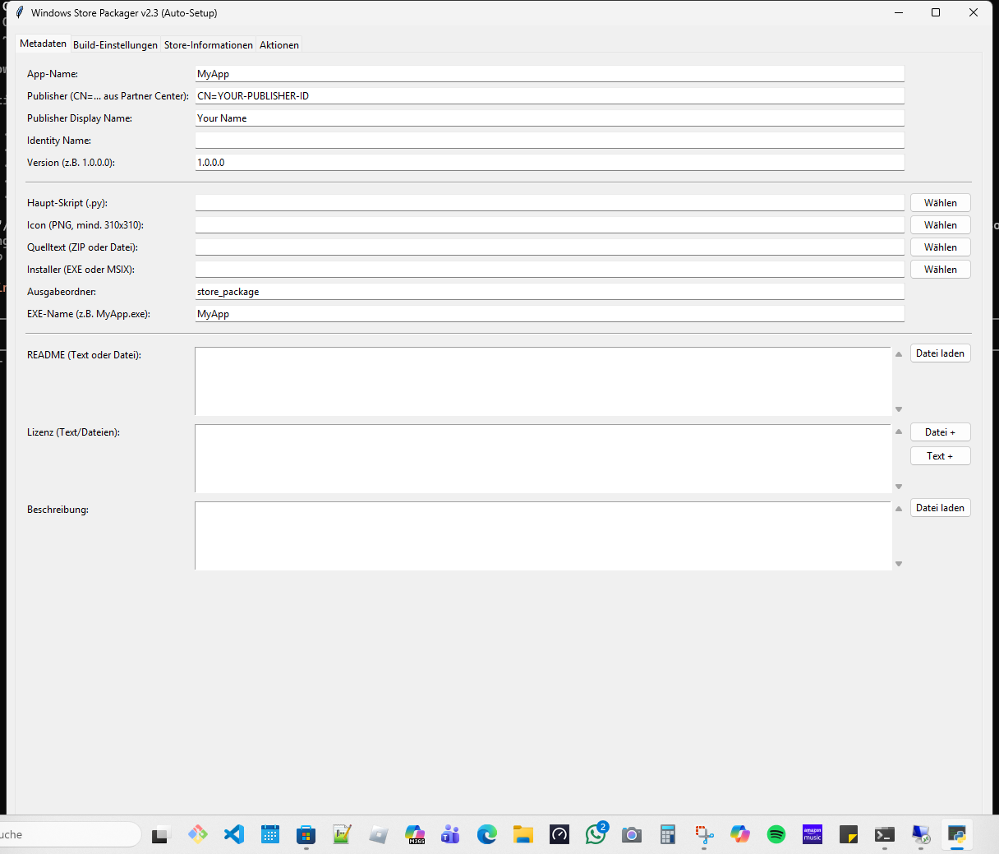

<p align="center">
  
  
  
  
  
</p>

<h1 align="center">WinStorePackager</h1>

<h4 align="center">Local-first Windows GUI for preparing Python apps for Microsoft Store submission: AppxManifest, Store icons, project profiles, screenshots, and MSIX packaging</h4>

---

## Start Here

| I want to... | Start with |
|---|---|
| Package a Python desktop app for the Microsoft Store | [`WindowsStorePublisher_3.py`](WindowsStorePublisher_3.py) on Windows |
| Prepare Store metadata before using Windows SDK tools | [`web_companion/index.html`](web_companion/index.html) |
| Share project metadata without local secrets | [`PROJECT_PROFILE_FORMAT.md`](PROJECT_PROFILE_FORMAT.md) |
| Check privacy and local-data boundaries | [`PRIVACY_POLICY.md`](PRIVACY_POLICY.md) and [Repository Hygiene](#repository-hygiene) |

WinStorePackager is built for solo developers and small teams that need a practical Python-to-Microsoft-Store workflow without setting up Visual Studio projects for every app. It focuses on the repetitive pieces: Store manifest fields, required icon sizes, screenshot collection, profile exchange, and Windows SDK packaging commands.

## Features

| Feature | Description |
|---------|-------------|
| **Manifest Generator** | Automatically creates `AppxManifest.xml` from form inputs |
| **Icon Generator** | All required Store sizes: 44×44, 50×50, 150×150, 310×310, 310×150 (Wide) |
| **Keyring Integration** | Secure storage of certificate passwords (no plaintext) |
| **Screenshot Assistant** | Captures app screenshots directly via `pygetwindow` |
| **11 Store Categories** | Predefined (Games, Productivity, Developer Tools, ...) |
| **Age Ratings** | 3+ to 18+ ratings |
| **MSIX Build** | Invokes `makeappx.exe` and `signtool.exe` from the Windows SDK |
| **Settings Persistence** | Configuration is saved in JSON and loaded on next launch |
| **Auto-Install** | Missing dependencies are automatically installed |

---

## Screenshot



The current UI combines manifest fields, icon generation, screenshot capture, and MSIX build preparation in one desktop workflow.

## Project Profile Exchange and Web Companion

WinStorePackager now ships with a shared project profile format: [`PROJECT_PROFILE_FORMAT.md`](PROJECT_PROFILE_FORMAT.md). The desktop app can import and export `winstorepackager-project-v1.json` so that Store metadata can be prepared outside Windows without exposing local Publisher IDs, SDK paths, certificate paths, or passwords.

The browser-based companion lives in [`web_companion/index.html`](web_companion/index.html). It offers the same project questionnaire, manifest preview, icon-size check, and JSON import/export as before, but now also supports a local app shell with service worker, offline fallback, install prompt, and a small cross-platform localhost starter.

```bash
python web_companion/serve_companion.py
```

Open `http://127.0.0.1:8765/index.html` if the browser does not launch automatically. Directly opening `web_companion/index.html` still works for local editing and JSON export, but install and offline features only work via `localhost` or `https`.

---

## Search and Discovery Context

Useful search phrases for this repository:

- `WinStorePackager Python Microsoft Store MSIX`
- `file-bricks WinStorePackager`
- `Python AppxManifest generator`
- `local-first MSIX packaging tool`
- `Microsoft Store packaging GUI for Python apps`

The project is not the Microsoft MSIX Packaging Tool and does not replace Partner Center submission. It is a local helper that prepares files and metadata before you run or submit the final package.

---

## Prerequisites

- Python 3.10+
- Windows 10/11
- [Windows SDK](https://developer.microsoft.com/en-us/windows/downloads/windows-sdk/) (for `makeappx.exe` and `signtool.exe`)
- Microsoft Store developer account (for submission)

```bash
pip install -r requirements.txt
```

---

## Installation

```bash
git clone https://github.com/file-bricks/WinStorePackager.git
cd WinStorePackager
pip install -r requirements.txt
python WindowsStorePublisher_3.py
```

Or on Windows, double-click `START.bat`.

---

## Getting Started

1. **Launch the tool** — `python WindowsStorePublisher_3.py` or `START.bat`
2. **Enter app data** — Name, Publisher ID, version, path to `.py` file
3. **Select icon** — the tool automatically generates all Store sizes
4. **Generate manifest** — `AppxManifest.xml` is created
5. **Build MSIX** — Tool invokes `makeappx.exe` and creates the package
6. **Sign** — Select certificate, enter password securely via Keyring

---

## Configuration

On first launch, `settings_store_packager.json` is created locally and ignored by Git. It may contain local Publisher IDs, certificate paths, Windows SDK paths, and other machine-specific settings. Template:

```json
{
  "app_name": "MyApp",
  "publisher": "CN=YOUR-PUBLISHER-ID",
  "publisher_display": "Your Name",
  "version": "1.0.0.0",
  "makeappx_path": "C:/Program Files (x86)/Windows Kits/10/App Certification Kit/makeappx.exe",
  "signtool_path": "C:/Program Files (x86)/Windows Kits/10/App Certification Kit/signtool.exe"
}
```

You can find your Publisher ID in the [Microsoft Partner Center](https://partner.microsoft.com/dashboard).

---

## Local Data and Build Artifacts

WinStorePackager works on local project files only. Generated MSIX packages, EXE builds, temporary staging folders, local settings, certificates, and release bundles are intentionally ignored by Git and should be distributed through GitHub Releases, Microsoft Store submissions, or another release channel instead of source commits.

If dependencies are missing, the launcher can install Python packages from PyPI via `pip`. After dependencies are installed, the packaging workflow itself runs locally and uses the Windows SDK tools configured on your machine.

## Repository Hygiene

The repository intentionally tracks only source code, documentation, workflow files, and static sample assets. Local Partner Center data, Publisher IDs in `settings_store_packager.json`, certificates, generated manifests, MSIX/AppX packages, WACK logs, screenshots, and release bundles stay outside Git via `.gitignore`.

Last visibility check: 2026-06-04. GitHub traffic showed 4 views from 2 unique visitors and 31 clones from 19 unique cloners in the current 14-day window. Web search for exact repository and product-name phrases did not show broad external visibility, so the README now includes clearer canonical naming and search phrases.

---

## Comparison with Alternatives

| Feature | WinStorePackager | MSIX Packaging Tool | Visual Studio | Advanced Installer |
|---------|:---:|:---:|:---:|:---:|
| GUI | ✅ | ⚠️ | ✅ | ✅ |
| Python Focus | ✅ | ❌ | ❌ | ❌ |
| Auto-Icons | ✅ | ❌ | ⚠️ | ✅ |
| Manifest Template | ✅ | ❌ | ✅ | ✅ |
| Free | ✅ | ✅ | ⚠️ | ❌ |
| Screenshot Assistant | ✅ | ❌ | ❌ | ❌ |
| Keyring Security | ✅ | ❌ | ❌ | ❌ |

---

## License

Dieses Projekt steht unter der [MIT License](LICENSE).

---

## English

A GUI tool for preparing Python applications for the Microsoft Store (MSIX packaging).

### Features

- MSIX package creation
- App manifest generation
- Icon and asset management
- Store submission preparation
- Shared project profile exchange via `winstorepackager-project-v1.json`
- Installable local browser companion with offline shell, manifest preview, and icon checks

### Installation

```bash
git clone https://github.com/file-bricks/WinStorePackager.git
cd WinStorePackager
pip install -r requirements.txt
python "WindowsStorePublisher_3.py"
```

### License

See [LICENSE](LICENSE) for details.

---

## Haftung / Liability

Dieses Projekt ist eine **unentgeltliche Open-Source-Schenkung** im Sinne der §§ 516 ff. BGB. Die Haftung des Urhebers ist gemäß **§ 521 BGB** auf **Vorsatz und grobe Fahrlässigkeit** beschränkt. Ergänzend gilt der Haftungsausschluss der MIT License.

Nutzung auf eigenes Risiko. Keine Wartungszusage, keine Verfügbarkeitsgarantie, keine Gewähr für Fehlerfreiheit oder Eignung für einen bestimmten Zweck.

This project is an unpaid open-source donation. Liability is limited to intent and gross negligence (§ 521 German Civil Code). Use at your own risk. No warranty, no maintenance guarantee, no fitness-for-purpose assumed.
