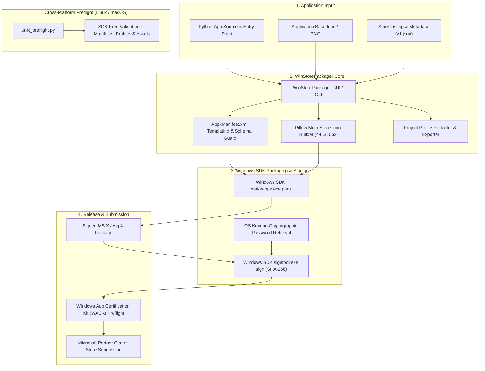
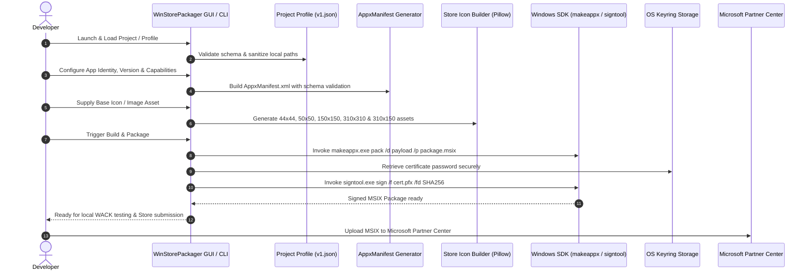

> **English** | [Deutsch](README_de.md)

<p align="center">
  
  
  
  
  
  
  
  
  
  
  
  
  
  
  
  
  
</p>

<h1 align="center">WinStorePackager</h1>

<h4 align="center">Local-first Windows GUI & CLI tool for preparing Python desktop applications for Microsoft Store submission: AppxManifest, Store icons, project profiles, screenshots, and MSIX packaging</h4>

<p align="center">
  <a href="#quick-start">Quick Start</a> •
  <a href="#features">Features</a> •
  <a href="#architecture--packaging-pipeline">Architecture</a> •
  <a href="#packaging-lifecycle-flow">Lifecycle Flow</a> •
  <a href="#governance--runtime-invariants">Governance & Invariants</a> •
  <a href="#visual-showcase--store-assets">Visual Showcase</a> •
  <a href="#project-profiles">Project Profiles</a> •
  <a href="#prerequisites--installation">Installation</a> •
  <a href="#sdk-free-unix-preflight">Unix Preflight</a> •
  <a href="#local-data-and-security">Local Data & Security</a> •
  <a href="#sibling-tools--ecosystem">Sibling Tools</a> •
  <a href="#comparison-with-alternatives">Comparison</a> •
  <a href="#third-party-licenses--transparency">Third-Party Licenses</a> •
  <a href="#marketing--target-personas">Marketing & Personas</a> •
  <a href="#documentation--license">Documentation & License</a>
</p>

> [!NOTE]
> **AI Agent & LLM Integration Notice**: High-level repository structure and context boundaries are documented in [`llms.txt`](llms.txt). LLM agents and automated tools can inspect package schemas via [`PROJECT_PROFILE_FORMAT.md`](PROJECT_PROFILE_FORMAT.md) and [`winstorepackager-project-v1.json`](winstorepackager-project-v1.json).

---

<a id="quick-start"></a>
<a id="schnellstart"></a>
## Quick Start

| I want to... | Start with |
|---|---|
| Package a Python desktop app for the Microsoft Store | [`WindowsStorePublisher_3.py`](WindowsStorePublisher_3.py) or `START.bat` on Windows |
| Run the SDK-free Unix (Linux/macOS) desktop preflight | [`unix_preflight.py`](unix_preflight.py) |
| Share project metadata without local secrets | [`PROJECT_PROFILE_FORMAT.md`](PROJECT_PROFILE_FORMAT.md) |
| Dogfood the WinStorePackager Store profile | [`winstorepackager-project-v1.json`](winstorepackager-project-v1.json) |
| Check security, local-data, and privacy boundaries | [`SECURITY.md`](SECURITY.md), [`PRIVACY_POLICY.md`](PRIVACY_POLICY.md), and [Local Data & Security](#local-data-and-security) |

WinStorePackager is built for solo developers, indie hackers, and software teams that need a practical Python-to-Microsoft-Store workflow without setting up heavy Visual Studio projects for every app. It focuses on the repetitive pieces: Store manifest fields, required icon sizes, screenshot collection, profile exchange, and Windows SDK packaging commands.

---

<a id="features"></a>
<a id="funktionen"></a>
## Features

| Feature | Description |
|---------|-------------|
| **Manifest Generator** | Automatically creates `AppxManifest.xml` from form inputs with XML schema validation and attribute escaping |
| **Icon Generator** | Generates all required Store sizes: 44×44, 50×50, 150×150, 310×310, 310×150 (Wide) with Lanczos resampling |
| **6-Language GUI (i18n)** | Full localization support (Tier 2 / P-006: DE, EN, ES, ZH, JA, RU) with runtime switching |
| **Keyring Integration** | Secure storage of certificate passwords via OS Keyring (no plaintext passwords on disk) |
| **Screenshot Assistant** | Captures app screenshots directly via `pygetwindow` for Microsoft Store listing assets |
| **11 Store Categories** | Predefined categories (Developer Tools, Productivity, Education, Utilities, ...) |
| **Age Ratings** | 3+ to 18+ ratings with compliant manifest capabilities declaration |
| **MSIX Build & Sign** | Invokes `makeappx.exe` and `signtool.exe` from the Windows SDK with SHA-256 code signing |
| **Settings Persistence** | Host-local JSON configuration outside Git with atomic migration safety |
| **SDK-Free Preflight** | Cross-platform validation of manifests, profiles, and listings on Linux & macOS |

---

<a id="architecture--packaging-pipeline"></a>
<a id="architektur--paketierungs-pipeline"></a>
## Architecture & Packaging Pipeline



---

<a id="packaging-lifecycle-flow"></a>
<a id="paketierungs-lebenszyklus"></a>
## Packaging Lifecycle Flow



---

<a id="governance--runtime-invariants"></a>
<a id="governance--laufzeit-invarianten"></a>
## Governance & Runtime Invariants

WinStorePackager enforces 10 strict governance and runtime invariants across development, packaging, and execution:

| Invariant ID | Rule & Principle | Enforcement Mechanism & Guarantee |
|---|---|---|
| **INV-LOCAL-01** | **100% Local-First & Zero-Egress** | All manifest compilation, icon rendering, packaging, and preflight checks run entirely offline. Zero outbound telemetry or cloud tracking. |
| **INV-SEC-02** | **Cryptographic Password Protection & Non-Elevation** | Signing certificate passwords reside exclusively in the OS Keyring (Windows Credential Vault). The app runs in user space (`RunAsInvoker`) without administrator elevation. |
| **INV-STORE-03** | **Microsoft Store Manifest Compliance** | Enforces strict XML schema validation, namespace handling, and attribute escaping compliant with Microsoft Partner Center guidelines. |
| **INV-ASSET-04** | **Multi-Scale Asset Integrity** | Deterministic high-quality Lanczos resampling generates exact Microsoft Store tile dimensions (44×44, 50×50, 150×150, 310×310, 310×150). |
| **INV-PROFILE-05** | **Redacted Profile Portability** | Shared project profiles (`winstorepackager-project-v1.json`) redact machine paths, Publisher IDs, certificate paths, and secrets for safe version-control sharing. |
| **INV-CROSS-06** | **Cross-Platform Preflight Parity** | `unix_preflight.py` executes full metadata, listing, and schema checks on Linux and macOS without requiring Windows SDK binaries. |
| **INV-STATE-07** | **Host-Local State Isolation & Atomic Writes** | Settings and rotating logs persist to `%LOCALAPPDATA%` outside git checkouts via atomic file replacement (`os.replace`) to prevent file corruption. |
| **INV-WACK-08** | **Fail-Closed WACK Certification Evaluation** | Deterministic parsing of Windows App Certification Kit reports with fail-closed rejection on errors or crashes (`FAIL`, `FAILED`, `ERROR`, `CRASH`). |
| **INV-I18N-09** | **Universal 6-Language Localization** | Complete Tier-2 multilingual GUI support (DE, EN, ES, ZH, JA, RU) with dynamic runtime switching and native umlauts. |
| **INV-SLA-10** | **Vulnerability Floor & 48h Security SLA** | Enforced minimum dependency floors (Pillow>=12.3.0, keyring>=25.0.0, pytest>=9.1.1), 48h initial security response SLA, and 5-day triage commitment. |

---

<a id="visual-showcase--store-assets"></a>
<a id="visuelle-showcase--store-assets"></a>
## Visual Showcase & Store Assets

| Store Feature | Visual Overview |
|---|---|
| **Main Overview & Packaging**<br>Interactive desktop GUI for application identity, source paths, and Windows SDK toolchain setup. |  |
| **Store Metadata & Ratings**<br>Predefined Store categories, age ratings, capabilities, support URLs, and localized privacy policies. |  |
| **Multi-Resolution Icon Builder**<br>Automated generation and preview of all required Microsoft Store square and wide tile icon formats. |  |
| **MSIX Packaging & Signing**<br>One-click MSIX package compilation, OS Keyring certificate authentication, and WACK preflight. |  |

Rebuild the curated Microsoft Store screenshot set at any time with:

```bash
python generate_store_screenshots.py
```

The generator writes four 1920x1080 PNGs to `releases/windowsstore/screenshots/` and uses only neutral demo metadata without exposing private paths, credentials, or Publisher IDs.

---

<a id="project-profiles"></a>
<a id="projektprofile"></a>
## Project Profiles

WinStorePackager ships with a shared project profile format: [`PROJECT_PROFILE_FORMAT.md`](PROJECT_PROFILE_FORMAT.md). The desktop app can import and export `winstorepackager-project-v1.json` so that Store metadata can be prepared outside Windows without exposing local Publisher IDs, SDK paths, certificate paths, or passwords.

This repository includes its own dogfooding profile, [`winstorepackager-project-v1.json`](winstorepackager-project-v1.json). Load it in the desktop app to package WinStorePackager with WinStorePackager, or validate it without the Windows SDK:

```bash
python unix_preflight.py --project-root . --profile-path winstorepackager-project-v1.json
```

The profile intentionally keeps Partner Center Publisher IDs, certificate paths, SDK paths, and passwords out of Git. Add those values only in local settings before building or signing an MSIX.

---

<a id="prerequisites--installation"></a>
<a id="voraussetzungen--installation"></a>
## Prerequisites & Installation

- Python 3.9–3.13+
- Windows 10/11 (for MSIX build and signing) or Linux/macOS (for preflight validation)
- [Windows SDK](https://developer.microsoft.com/en-us/windows/downloads/windows-sdk/) (for `makeappx.exe` and `signtool.exe`)
- Microsoft Store developer account (for submission)

```bash
git clone https://github.com/file-bricks/WinStorePackager.git
cd WinStorePackager
pip install -r requirements.txt
python WindowsStorePublisher_3.py
```

Or on Windows, double-click `START.bat`.

---

<a id="sdk-free-unix-preflight"></a>
<a id="sdk-freier-unix-preflight"></a>
## SDK-Free Unix Preflight

For Linux/macOS workstations or CI runs without the Windows SDK, the repository includes a metadata-only preflight:

```bash
python unix_preflight.py --project-root .
python unix_preflight.py --project-root . --profile-path ./winstorepackager-project-v1.json
```

The Unix preflight checks project structure, `store_package.json`, README, privacy policy, Store listing, screenshot/icon artifacts, and exported project profiles without building MSIX packages or requiring Windows binaries.

---

<a id="local-data-and-security"></a>
<a id="lokale-daten-und-sicherheit"></a>
## Local Data and Security

WinStorePackager operates on local project files only:

- **Host-Local Runtime Directories:** Machine-specific settings and rotating logs live outside the source checkout in `%LOCALAPPDATA%\WinStorePackager` (Windows), `~/Library/Application Support/WinStorePackager` (macOS), or `${XDG_CONFIG_HOME:-~/.config}/winstorepackager` (Linux).
- **Keyring Cryptographic Storage:** Certificate passwords remain in the operating-system Keyring and are never written to disk or JSON files.
- **Git Hygiene:** Generated MSIX packages, EXE builds, temporary staging folders, certificates, and release bundles are strictly ignored by Git.

Template for machine-specific runtime settings (`settings_store_packager.json`):

```json
{
  "app_name": "MyApp",
  "publisher": "CN=YOUR-PUBLISHER-ID",
  "publisher_display": "Your Name",
  "version": "1.0.0.0",
  "makeappx_path": "C:/Program Files (x86)/Windows Kits/10/App Certification Kit/makeappx.exe",
  "signtool_path": "C:/Program Files (x86)/Windows Kits/10/App Certification Kit/signtool.exe"
}
```

---

<a id="sibling-tools--ecosystem"></a>
<a id="geschwister-tools--ökosystem"></a>
## Sibling Tools & Ecosystem

WinStorePackager is part of the **file-bricks** and **open-bricks** open-source software family:

| Tool | Ecosystem | Purpose |
|---|---|---|
| **[ProSync](https://github.com/file-bricks/ProSync)** | `file-bricks` | Local-first file synchronization & SQLite WAL consistency guard |
| **[CleanMarkdown](https://github.com/doc-bricks/CleanMarkdown)** | `doc-bricks` | Markdown sanitization, whitespace repair & document formatting |
| **[DokuZen](https://github.com/doc-bricks/DokuZen)** | `doc-bricks` | Fast, local-first technical documentation & knowledge organizer |
| **[UniversalDocsGrabber](https://github.com/doc-bricks/UniversalDocsGrabber)** | `doc-bricks` | Universal document ingestion, OCR conversion & search engine |
| **[ellmos-filecommander-mcp](https://github.com/ellmos-ai/ellmos-filecommander-mcp)** | `ellmos-ai` | Local MCP server for safe file management, OCR & search |
| **[open-bricks](https://github.com/open-bricks)** | `open-bricks` | Umbrella organization for modular desktop & developer tools |

---

<a id="comparison-with-alternatives"></a>
<a id="vergleich-mit-alternativen"></a>
## Comparison with Alternatives

| Feature | WinStorePackager | MSIX Packaging Tool | Visual Studio | Advanced Installer |
|---------|:---:|:---:|:---:|:---:|
| GUI | ✅ | ⚠️ | ✅ | ✅ |
| Python Focus | ✅ | ❌ | ❌ | ❌ |
| Auto-Icons (All Sizes) | ✅ | ❌ | ⚠️ | ✅ |
| Manifest Generator | ✅ | ❌ | ✅ | ✅ |
| Free / Open Source | ✅ | ✅ | ⚠️ | ❌ |
| Screenshot Assistant | ✅ | ❌ | ❌ | ❌ |
| Keyring Security | ✅ | ❌ | ❌ | ❌ |
| 6-Language Localization | ✅ | ❌ | ⚠️ | ⚠️ |
| Cross-Platform Preflight | ✅ | ❌ | ❌ | ❌ |

---

<a id="third-party-licenses--transparency"></a>
<a id="drittanbieter-lizenzen--transparenz"></a>
## Third-Party Licenses & Transparency

WinStorePackager is audited to ensure 100% license transparency and zero-egress compliance:

- **Complete Inventory:** Detailed upstream package listings, licenses, and notices are maintained in [`THIRD_PARTY_LICENSES.md`](THIRD_PARTY_LICENSES.md) and [`THIRD_PARTY_LICENSES.txt`](THIRD_PARTY_LICENSES.txt).
- **Runtime Packages:** Includes Pillow (`HPND-sell-variant`), keyring (`MIT`), and pygetwindow (`BSD-3-Clause`) with strict vulnerability floors.
- **Build & Packaging:** PyInstaller (`GPL-2.0-or-later WITH Bootloader-exception`), pyinstaller-hooks-contrib (`Apache-2.0`), and packaging (`Apache-2.0 OR BSD-2-Clause`).
- **Quality Assurance & Testing:** pytest (`MIT`, `>=9.1.1`), pluggy (`MIT`), and ruff (`MIT OR Apache-2.0`).
- **Standard Library:** Python Software Foundation License (`PSFL-2.0`). External Windows SDK binaries are proprietary to Microsoft and called via standard unprivileged sub-process execution.

---

<a id="marketing--target-personas"></a>
<a id="marketing--zielgruppen"></a>
## Marketing & Target Personas

WinStorePackager is optimized for discoverability and targeted towards four core developer segments:

### Target Personas

1. **Solo Python Desktop Developers & Indie Hackers:** Need an effortless pathway from standalone Python scripts (Tkinter, PyQt, PySide, CustomTkinter) to Microsoft Store distribution without setting up Visual Studio or learning complex XML schema specifications.
2. **Enterprise & Commercial Python ISVs:** Require reproducible, scriptable packaging pipelines, strict OS Keyring credential protection for proprietary code signing certificates, and fail-closed WACK validation.
3. **Open-Source Maintainers & Multi-OS Teams:** Develop primarily on Linux or macOS and demand SDK-free preflight validation in CI workflows before touching Windows deployment machines.
4. **Privacy-Conscious & Local-First Desktop Builders:** Require 100% offline packaging, zero telemetry, non-elevation `RunAsInvoker` security, and redacted project profiles.

### High-Intent Search Phrases

- `WinStorePackager Python Microsoft Store MSIX`
- `file-bricks WinStorePackager`
- `Python AppxManifest generator`
- `local-first MSIX packaging tool`
- `Microsoft Store packaging GUI for Python apps`
- `MSIX packaging tool without Visual Studio`
- `Python desktop app Windows Store submission helper`
- `AppxManifest XML generator Python`

See [`MARKETING-LOG.txt`](MARKETING-LOG.txt) for full keyword rankings, persona pain-point analyses, and competitive positioning data.

---

<a id="documentation--license"></a>
<a id="dokumentation--lizenz"></a>
## Documentation & License

- 📄 **Security Policy:** [`SECURITY.md`](SECURITY.md) — Bilingual vulnerability disclosure & local-first guarantees
- ⚖️ **Attribution Notice:** [`NOTICE`](NOTICE) — Canonical copyright, open-bricks ecosystem attribution & dependency references
- 📝 **Changelog:** [`CHANGELOG.md`](CHANGELOG.md) — Version history and release notes
- 🤖 **LLM Reference:** [`llms.txt`](llms.txt) — Machine-readable architectural guide
- 📦 **Profile Format:** [`PROJECT_PROFILE_FORMAT.md`](PROJECT_PROFILE_FORMAT.md) — Portable project profile specification
- 📜 **Third-Party Licenses:** [`THIRD_PARTY_LICENSES.md`](THIRD_PARTY_LICENSES.md) & [`THIRD_PARTY_LICENSES.txt`](THIRD_PARTY_LICENSES.txt)
- 📊 **Marketing Log:** [`MARKETING-LOG.txt`](MARKETING-LOG.txt) — Persona and discoverability registry

### License & Liability

Dieses Projekt steht unter der [MIT License](LICENSE).

Dieses Projekt ist eine **unentgeltliche Open-Source-Schenkung** im Sinne der §§ 516 ff. BGB. Die Haftung des Urhebers ist gemäß **§ 521 BGB** auf **Vorsatz und grobe Fahrlässigkeit** beschränkt. Ergänzend gilt der Haftungsausschluss der MIT License.

Nutzung auf eigenes Risiko. Keine Wartungszusage, keine Verfügbarkeitsgarantie, keine Gewähr für Fehlerfreiheit oder Eignung für einen bestimmten Zweck.

This project is an unpaid open-source donation. Liability is limited to intent and gross negligence (§ 521 German Civil Code). Use at your own risk. No warranty, no maintenance guarantee, no fitness-for-purpose assumed.
