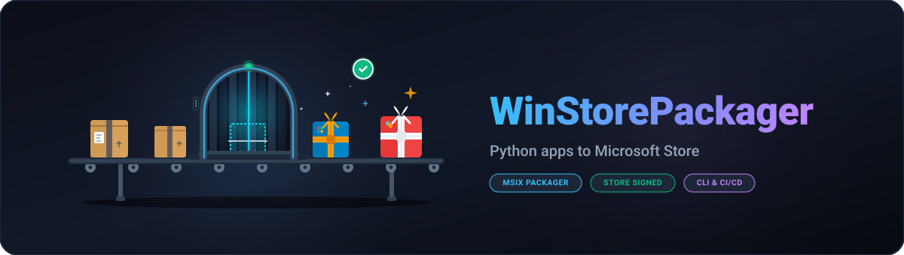
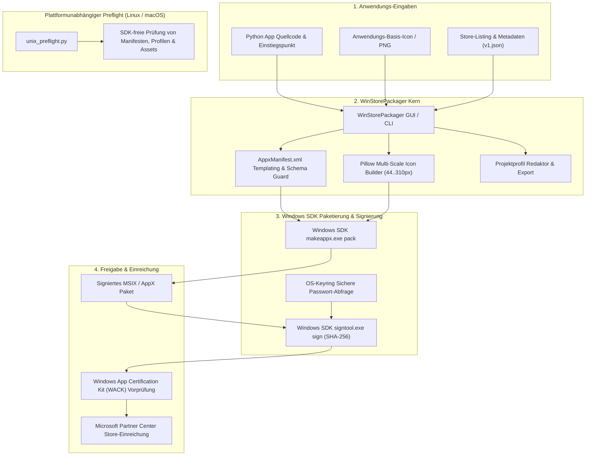
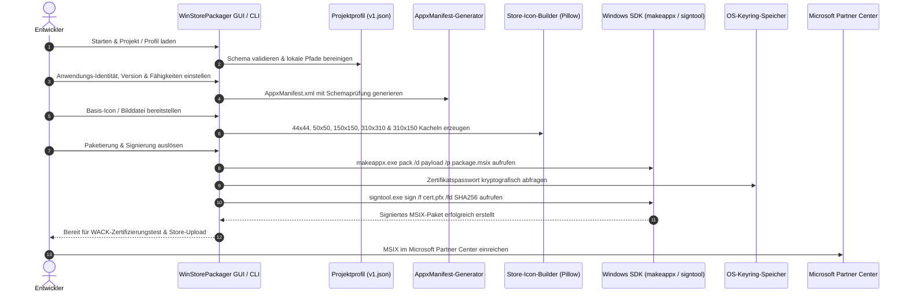
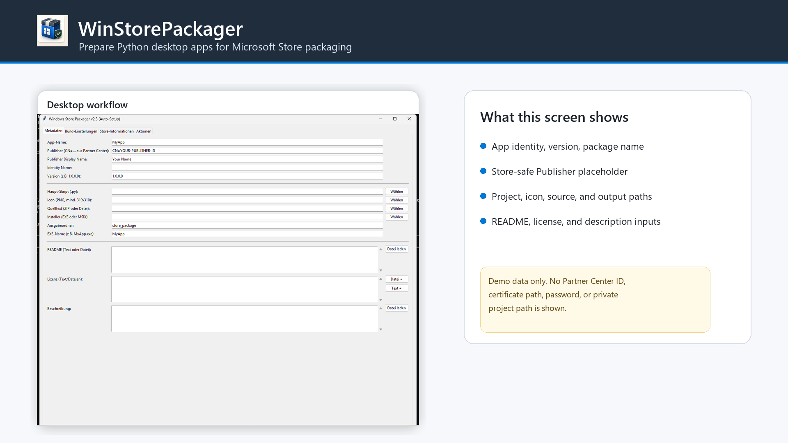
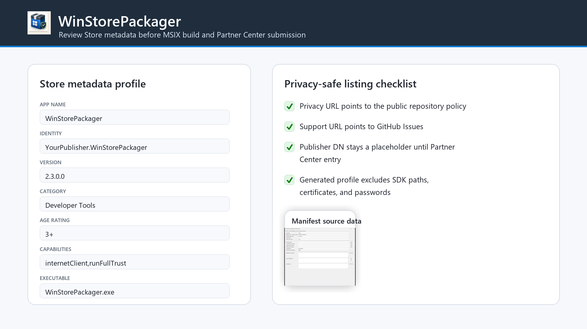
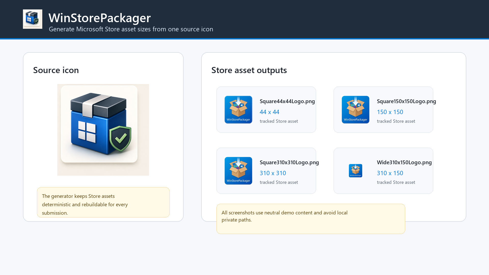
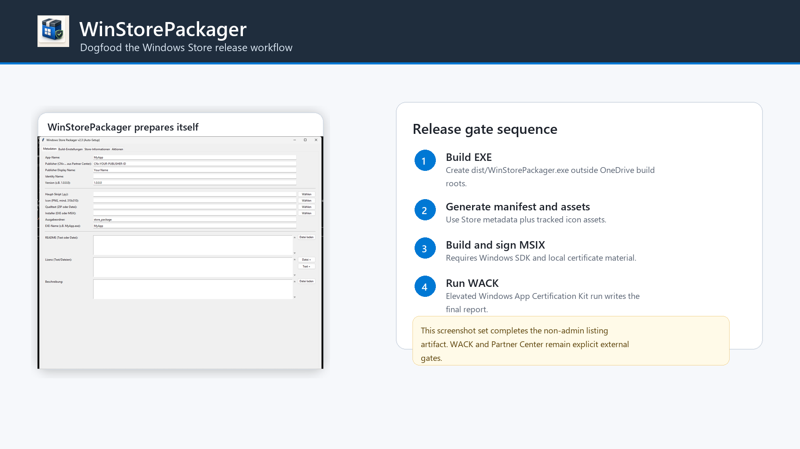

> [English](README.md) | **Deutsch**

<p align="center">
  
  
  
  
  
  
  
  
  
  
  
  
  
  
  
  
  
</p>

<h1 align="center">WinStorePackager</h1>

<h4 align="center">Lokales Windows-GUI- & CLI-Werkzeug zur Vorbereitung von Python-Apps für den Microsoft Store: AppxManifest, Store-Icons, Projektprofile, Screenshots und MSIX-Paketierung</h4>

<p align="center">
  <a href="#schnellstart">Schnellstart</a> •
  <a href="#funktionen">Funktionen</a> •
  <a href="#architektur--paketierungs-pipeline">Architektur</a> •
  <a href="#paketierungs-lebenszyklus">Lebenszyklus</a> •
  <a href="#governance--laufzeit-invarianten">Governance & Invarianten</a> •
  <a href="#visuelle-showcase--store-assets">Showcase</a> •
  <a href="#projektprofile">Projektprofile</a> •
  <a href="#voraussetzungen--installation">Installation</a> •
  <a href="#sdk-freier-unix-preflight">Unix-Preflight</a> •
  <a href="#lokale-daten-und-sicherheit">Lokale Daten & Sicherheit</a> •
  <a href="#geschwister-tools--ökosystem">Ökosystem</a> •
  <a href="#vergleich-mit-alternativen">Vergleich</a> •
  <a href="#drittanbieter-lizenzen--transparenz">Drittanbieter-Lizenzen</a> •
  <a href="#marketing--zielgruppen">Marketing & Zielgruppen</a> •
  <a href="#dokumentation--lizenz">Dokumentation & Lizenz</a>
</p>

> [!NOTE]
> **Hinweis für KI-Agenten & LLMs**: Die Repository-Struktur und KI-Kontextgrenzen sind in [`llms.txt`](llms.txt) beschrieben. Austauschformate und Metadaten-Schemas finden sich in [`PROJECT_PROFILE_FORMAT.md`](PROJECT_PROFILE_FORMAT.md) und [`winstorepackager-project-v1.json`](winstorepackager-project-v1.json).

---

<a id="quick-start"></a>
<a id="schnellstart"></a>
## Schnellstart

| Ziel | Einstieg |
|---|---|
| Python-App für den Microsoft Store vorbereiten & bauen | [`WindowsStorePublisher_3.py`](WindowsStorePublisher_3.py) oder `START.bat` auf Windows |
| Store-Metadaten ohne Windows SDK auf Linux/macOS prüfen | [`unix_preflight.py`](unix_preflight.py) |
| Store-Screenshots mit neutralen Demo-Metadaten neu erzeugen | `python generate_store_screenshots.py` |
| Projektprofil ohne lokale Geheimnisse austauschen | [`PROJECT_PROFILE_FORMAT.md`](PROJECT_PROFILE_FORMAT.md) |
| WinStorePackager mit eigenem Profil testen (Dogfooding) | [`winstorepackager-project-v1.json`](winstorepackager-project-v1.json) |
| Sicherheits-, Datenschutz- und Git-Grenzen prüfen | [`SECURITY.md`](SECURITY.md), [`PRIVACY_POLICY.md`](PRIVACY_POLICY.md) und [Lokale Daten & Sicherheit](#lokale-daten-und-sicherheit) |

WinStorePackager richtet sich an kleine Teams und Einzelentwickler, die eine bestehende Python-App nicht jedes Mal in ein schwerfälliges Visual-Studio-Projekt umziehen möchten. Das Werkzeug bündelt die wiederkehrenden Schritte: AppxManifest-Metadaten, Store-Icon-Skalierung, Screenshot-Sammlung, Profilaustausch und Windows-SDK-Befehle.

---

<a id="features"></a>
<a id="funktionen"></a>
## Funktionen

| Funktion | Beschreibung |
|---------|-------------|
| **Manifest-Generator** | Erzeugt automatisch ein valides `AppxManifest.xml` mit Schema-Prüfung und XML-Attribut-Maskierung aus Formulareingaben |
| **Icon-Generator** | Erstellt alle geforderten Store-Größen: 44×44, 50×50, 150×150, 310×310 und 310×150 (Wide) via Lanczos-Resampling |
| **6-Sprachen-GUI (i18n)** | Vollständige Mehrsprachigkeit (Tier 2 / P-006: DE, EN, ES, ZH, JA, RU) mit dynamischer Laufzeitumschaltung |
| **Keyring-Sicherheit** | Sichere Verwahrung von Zertifikatspasswörtern im OS-Keyring (kein Klartext auf der Festplatte) |
| **Screenshot-Assistent** | Automatische Erfassung von Anwendungsfenstern via `pygetwindow` für Store-Listings |
| **11 Store-Kategorien** | Vordefinierte Store-Kategorien (Entwicklertools, Produktivität, Bildung, Dienstprogramme, ...) |
| **Altersfreigaben** | Vordefinierte Einstufungen von 3+ bis 18+ mit konformer Manifest-Deklaration |
| **MSIX Build & Sign** | Integrierte Ausführung von `makeappx.exe` und `signtool.exe` aus dem Windows SDK mit SHA-256 Code-Signierung |
| **Laufzeit-Einstellungen** | Host-lokale JSON-Konfiguration außerhalb von Git mit atomarer Migrationsabsicherung |
| **SDK-freies Preflight** | Plattformunabhängige Validierung von Manifesten, Profilen und Store-Assets auf Linux & macOS |

---

<a id="architecture--packaging-pipeline"></a>
<a id="architektur--paketierungs-pipeline"></a>
## Architektur & Paketierungs-Pipeline



---

<a id="packaging-lifecycle-flow"></a>
<a id="paketierungs-lebenszyklus"></a>
## Paketierungs-Lebenszyklus



---

<a id="governance--runtime-invariants"></a>
<a id="governance--laufzeit-invarianten"></a>
## Governance & Laufzeit-Invarianten

WinStorePackager folgt 10 verbindlichen Architektur-, Sicherheits- und Governance-Invarianten:

| Invarianten-ID | Regel & Leitprinzip | Durchsetzungs- & Absicherungsmechanismus |
|---|---|---|
| **INV-LOCAL-01** | **100% Local-First & Zero-Egress** | Alle Manifest-Erstellungen, Icon-Skalierungen und Vorprüfungen laufen vollständig offline. Keinerlei Telemetrie oder Cloud-Tracking. |
| **INV-SEC-02** | **Kryptografischer Passwortschutz & Non-Elevation** | Zertifikatspasswörter liegen ausschließlich im OS-Keyring (Windows Credential Vault). Die App läuft im Benutzerkontext (`RunAsInvoker`) ohne Admin-Rechte. |
| **INV-STORE-03** | **Microsoft Store Manifest-Konformität** | Strikte XML-Schemavalidierung, Namensraumbehandlung und Attribut-Maskierung gemäß Microsoft Partner Center Richtlinien. |
| **INV-ASSET-04** | **Multi-Skalierungs-Asset-Integrität** | Deterministische Lanczos-Interpolation erzeugt exakte Store-Kachelauflösungen (44×44, 50×50, 150×150, 310×310, 310×150). |
| **INV-PROFILE-05** | **Portabilität redigierter Projektprofile** | Geteilte Projektprofile (`winstorepackager-project-v1.json`) bereinigen lokale Pfade, Publisher-IDs, Zertifikatspfade und Geheimnisse für Versionskontrolle. |
| **INV-CROSS-06** | **Plattformunabhängige Preflight-Parität** | `unix_preflight.py` prüft Metadaten, Store-Listings und Schemata auf Linux und macOS identisch ohne Notwendigkeit für Windows-SDK-Binaries. |
| **INV-STATE-07** | **Host-lokale Zustandsisolation & atomare Schreibvorgänge** | Einstellungen und rotierende Logs verbleiben in `%LOCALAPPDATA%` außerhalb von Git via atomarem Dateiaustausch (`os.replace`). |
| **INV-WACK-08** | **Fail-Closed WACK-Zertifizierungsbewertung** | Deterministisches Parsen der Windows App Certification Kit Prüfberichte mit Fail-Closed-Verhalten bei Fehlern oder Abstürzen (`FAIL`, `FAILED`, `ERROR`, `CRASH`). |
| **INV-I18N-09** | **Universelle 6-Sprachen-Lokalisierung** | Vollständige Tier-2 Mehrsprachigkeit (DE, EN, ES, ZH, JA, RU) mit dynamischer Umschaltung und echten deutschen Umlauten. |
| **INV-SLA-10** | **Vulnerability-Floors & 48h-Sicherheits-SLA** | Verbindliche Versionsuntergrenzen (Pillow>=12.3.0, keyring>=25.0.0, pytest>=9.1.1), 48h-Reaktionszeit bei Sicherheitsmeldungen und 5-Tage-Triage-Zusage. |

---

<a id="visual-showcase--store-assets"></a>
<a id="visuelle-showcase--store-assets"></a>
## Visuelle Showcase & Store-Assets

| Store-Funktion | Visuelle Übersicht |
|---|---|
| **Hauptübersicht & Paketierung**<br>Interaktives Desktop-GUI für Anwendungsidentität, Quellpfade und Windows-SDK-Werkzeuge. |  |
| **Store-Metadaten & Freigaben**<br>Vordefinierte Store-Kategorien, Altersfreigaben, App-Fähigkeiten, Support-URLs und lokalisierte Datenschutzrichtlinien. |  |
| **Multi-Auflösungs-Icon-Generator**<br>Automatisierte Erstellung und Vorschau aller geforderten quadratischen und breiten Microsoft Store Kachelformate. |  |
| **MSIX-Paketierung & Signierung**<br>Ein-Klick-MSIX-Erstellung, OS-Keyring-Zertifikatsauthentifizierung und integrierter WACK-Preflight. |  |

Der Microsoft Store Screenshot-Satz kann jederzeit mit folgendem Befehl neu generiert werden:

```bash
python generate_store_screenshots.py
```

Das Skript erzeugt vier PNGs in 1920x1080 Auflösung unter `releases/windowsstore/screenshots/` mit neutralen Demo-Metadaten ohne Offenlegung privater Pfade oder Publisher-IDs.

---

<a id="project-profiles"></a>
<a id="projektprofile"></a>
## Projektprofile

WinStorePackager verfügt über ein portables Profilformat: [`PROJECT_PROFILE_FORMAT.md`](PROJECT_PROFILE_FORMAT.md). Die Desktop-App kann `winstorepackager-project-v1.json` importieren und exportieren, sodass Store-Metadaten plattformunabhängig vorbereitet werden können, ohne lokale Publisher-IDs, Zertifikatspfade oder Passwörter preiszugeben.

Das Repository enthält ein eigenes Dogfooding-Profil [`winstorepackager-project-v1.json`](winstorepackager-project-v1.json). Sie können es laden, um WinStorePackager mit sich selbst zu paketieren oder ohne Windows SDK zu prüfen:

```bash
python unix_preflight.py --project-root . --profile-path winstorepackager-project-v1.json
```

---

<a id="prerequisites--installation"></a>
<a id="voraussetzungen--installation"></a>
## Voraussetzungen & Installation

- Python 3.9–3.13+
- Windows 10/11 (für MSIX-Build und Signierung) oder Linux/macOS (für Vorprüfung)
- [Windows SDK](https://developer.microsoft.com/en-us/windows/downloads/windows-sdk/) (für `makeappx.exe` und `signtool.exe`)
- Microsoft Store Entwicklerkonto (für Einreichung)

```bash
git clone https://github.com/file-bricks/WinStorePackager.git
cd WinStorePackager
pip install -r requirements.txt
python WindowsStorePublisher_3.py
```

Or on Windows, double-click `START.bat`.

---

<a id="sdk-free-unix-preflight"></a>
<a id="sdk-freier-unix-preflight"></a>
## SDK-freier Unix-Preflight

Für Linux/macOS-Entwicklungsrechner oder CI-Pipelines ohne Windows SDK bietet das Repository eine metadatenbasierte Vorprüfung:

```bash
python unix_preflight.py --project-root .
python unix_preflight.py --project-root . --profile-path ./winstorepackager-project-v1.json
```

Der Unix-Preflight prüft Projektstruktur, `store_package.json`, README, Datenschutzerklärung, Store-Listing, Screenshot/Icon-Assets und exportierte Projektprofile vollständig ohne Windows-Binärdateien.

---

<a id="local-data-and-security"></a>
<a id="lokale-daten-und-sicherheit"></a>
## Lokale Daten und Sicherheit

WinStorePackager arbeitet ausschließlich auf lokalen Projektdateien:

- **Host-lokale Laufzeitpfade:** Maschinenspezifische Einstellungen und rotierende Logs liegen außerhalb des Repositories in `%LOCALAPPDATA%\WinStorePackager` (Windows), `~/Library/Application Support/WinStorePackager` (macOS) oder `${XDG_CONFIG_HOME:-~/.config}/winstorepackager` (Linux).
- **Keyring-Zertifikatssicherheit:** Zertifikatspasswörter verbleiben im Betriebssystem-Keyring und werden niemals im Klartext oder in JSON-Dateien gespeichert.
- **Git-Hygiene:** Erzeugte MSIX-Pakete, EXE-Builds, temporäre Bereitstellungsordner, Zertifikate und Release-Archive werden von Git ignoriert.

Vorlage für maschinenspezifische Einstellungen (`settings_store_packager.json`):

```json
{
  "app_name": "MyApp",
  "publisher": "CN=IHRE-PUBLISHER-ID",
  "publisher_display": "Ihr Name",
  "version": "1.0.0.0",
  "makeappx_path": "C:/Program Files (x86)/Windows Kits/10/App Certification Kit/makeappx.exe",
  "signtool_path": "C:/Program Files (x86)/Windows Kits/10/App Certification Kit/signtool.exe"
}
```

---

<a id="sibling-tools--ecosystem"></a>
<a id="geschwister-tools--ökosystem"></a>
## Geschwister-Tools & Ökosystem

WinStorePackager ist Teil der **file-bricks** und **open-bricks** Open-Source-Softwarefamilie:

| Werkzeug | Ökosystem | Zweck |
|---|---|---|
| **[ProSync](https://github.com/file-bricks/ProSync)** | `file-bricks` | Lokale Dateisynchronisation mit SQLite WAL-Konsistenzwächter |
| **[CleanMarkdown](https://github.com/doc-bricks/CleanMarkdown)** | `doc-bricks` | Markdown-Bereinigung, Whitespace-Reparatur und Dokumentenformatierung |
| **[DokuZen](https://github.com/doc-bricks/DokuZen)** | `doc-bricks` | Schneller, lokaler Organizer für technische Dokumentation |
| **[UniversalDocsGrabber](https://github.com/doc-bricks/UniversalDocsGrabber)** | `doc-bricks` | Universelle Dokumentenerfassung, OCR-Konvertierung & Volltextsuche |
| **[ellmos-filecommander-mcp](https://github.com/ellmos-ai/ellmos-filecommander-mcp)** | `ellmos-ai` | Lokaler MCP-Server für sichere Dateiverwaltung, OCR und Suche |
| **[open-bricks](https://github.com/open-bricks)** | `open-bricks` | Dachorganisation für modulare Desktop- und Entwicklerwerkzeuge |

---

<a id="comparison-with-alternatives"></a>
<a id="vergleich-mit-alternativen"></a>
## Vergleich mit Alternativen

| Funktion | WinStorePackager | MSIX Packaging Tool | Visual Studio | Advanced Installer |
|---------|:---:|:---:|:---:|:---:|
| GUI | ✅ | ⚠️ | ✅ | ✅ |
| Python-Fokus | ✅ | ❌ | ❌ | ❌ |
| Auto-Icons (alle Größen) | ✅ | ❌ | ⚠️ | ✅ |
| Manifest-Generator | ✅ | ❌ | ✅ | ✅ |
| Kostenlos / Open Source | ✅ | ✅ | ⚠️ | ❌ |
| Screenshot-Assistent | ✅ | ❌ | ❌ | ❌ |
| Keyring-Sicherheit | ✅ | ❌ | ❌ | ❌ |
| 6-Sprachen-Lokalisierung | ✅ | ❌ | ⚠️ | ⚠️ |
| Plattformunabhängiger Preflight | ✅ | ❌ | ❌ | ❌ |

---

<a id="third-party-licenses--transparency"></a>
<a id="drittanbieter-lizenzen--transparenz"></a>
## Drittanbieter-Lizenzen & Transparenz

WinStorePackager ist vollständig geprüft hinsichtlich Lizenzkonformität und Zero-Egress:

- **Vollständiges Inventar:** Detaillierte Auflistungen aller Pakete, Lizenzen und Hinweise finden sich in [`THIRD_PARTY_LICENSES.md`](THIRD_PARTY_LICENSES.md) und [`THIRD_PARTY_LICENSES.txt`](THIRD_PARTY_LICENSES.txt).
- **Laufzeit-Abhängigkeiten:** Enthält Pillow (`HPND-sell-variant`), keyring (`MIT`) und pygetwindow (`BSD-3-Clause`) mit gehärteten Sicherheits-Floors.
- **Build & Paketierung:** PyInstaller (`GPL-2.0-or-later WITH Bootloader-exception`), pyinstaller-hooks-contrib (`Apache-2.0`) und packaging (`Apache-2.0 OR BSD-2-Clause`).
- **Qualitätssicherung & Tests:** pytest (`MIT`, `>=9.1.1`), pluggy (`MIT`) und ruff (`MIT OR Apache-2.0`).
- **Standardbibliothek:** Python Software Foundation License (`PSFL-2.0`). Die proprietären Windows-SDK-Binärdateien verbleiben bei Microsoft und werden als unprivilegierte Subprozesse ausgeführt.

---

<a id="marketing--target-personas"></a>
<a id="marketing--zielgruppen"></a>
## Marketing & Zielgruppen

WinStorePackager ist für Auffindbarkeit optimiert und richtet sich an vier zentrale Entwickler-Zielgruppen:

### Zielgruppen

1. **Python-Desktop-Einzelentwickler & Indie-Hacker:** Suchen einen einfachen, direkten Weg von Standalone-Skripten (Tkinter, PyQt, PySide, CustomTkinter) in den Microsoft Store ohne Visual Studio oder manuelle XML-Dateien.
2. **Kommerzielle Softwarehäuser & Python-ISVs:** Benötigen reproduzierbare, skriptbare Paketierungs-Pipelines, kryptografischen OS-Keyring-Zertifikatsschutz und Fail-Closed WACK-Validierung.
3. **Open-Source-Maintainer & Multi-OS-Teams:** Entwickeln primär unter Linux oder macOS und fordern SDK-freie Vorprüfungen in CI-Workflows vor dem Deployment auf Windows.
4. **Datenschutz- & Local-First-Entwickler:** Verlangen 100% Offline-Paketierung, null Telemetrie, unprivilegierte `RunAsInvoker`-Ausführung und portierbare bereinigte Profile.

### Suchbegriffe mit hoher Absicht

- `Python Windows Store MSIX Paketierung Tool`
- `AppxManifest Generator Python Deutsch`
- `Microsoft Store Paketierung ohne Visual Studio`
- `Python App im Microsoft Store veröffentlichen`
- `MSIX Erstellung und Signierung Python GUI`
- `file-bricks Windows Store Paketierer`
- `Lokale Store-Zertifizierung WACK Vorprüfung`
- `Store Kacheln und Icons automatisch generieren`

Ausführliche Persona-Schmerzpunktanalysen und Keyword-Rankings sind im [`MARKETING-LOG.txt`](MARKETING-LOG.txt) hinterlegt.

---

<a id="documentation--license"></a>
<a id="dokumentation--lizenz"></a>
## Dokumentation & Lizenz

- 📄 **Sicherheitsrichtlinie:** [`SECURITY.md`](SECURITY.md) — Zweisprachige Sicherheitsrichtlinie mit Zero-Egress-Garantie
- ⚖️ **Urheberrechts- & Zuordnungshinweis:** [`NOTICE`](NOTICE) — Kanonische Copyright-, open-bricks-Ökosystem-Zuordnung & Abhängigkeitsreferenzen
- 📝 **Änderungsprotokoll:** [`CHANGELOG.md`](CHANGELOG.md) — Versionshistorie und Release-Notizen
- 🤖 **LLM-Referenz:** [`llms.txt`](llms.txt) — Maschinenlesbare Architekturübersicht
- 📦 **Profilformat:** [`PROJECT_PROFILE_FORMAT.md`](PROJECT_PROFILE_FORMAT.md) — Portierbare Profilspezifikation
- 📜 **Drittanbieter-Lizenzen:** [`THIRD_PARTY_LICENSES.md`](THIRD_PARTY_LICENSES.md) & [`THIRD_PARTY_LICENSES.txt`](THIRD_PARTY_LICENSES.txt)
- 📊 **Marketing-Log:** [`MARKETING-LOG.txt`](MARKETING-LOG.txt) — Register für Zielgruppen und Auffindbarkeit

### Lizenz & Haftung

Dieses Projekt steht unter der [MIT License](LICENSE).

Dieses Projekt ist eine **unentgeltliche Open-Source-Schenkung** im Sinne der §§ 516 ff. BGB. Die Haftung des Urhebers ist gemäß **§ 521 BGB** auf **Vorsatz und grobe Fahrlässigkeit** beschränkt. Ergänzend gilt der Haftungsausschluss der MIT License.

Nutzung auf eigenes Risiko. Keine Wartungszusage, keine Verfügbarkeitsgarantie, keine Gewähr für Fehlerfreiheit oder Eignung für einen bestimmten Zweck.

This project is an unpaid open-source donation. Liability is limited to intent and gross negligence (§ 521 German Civil Code). Use at your own risk. No warranty, no maintenance guarantee, no fitness-for-purpose assumed.
