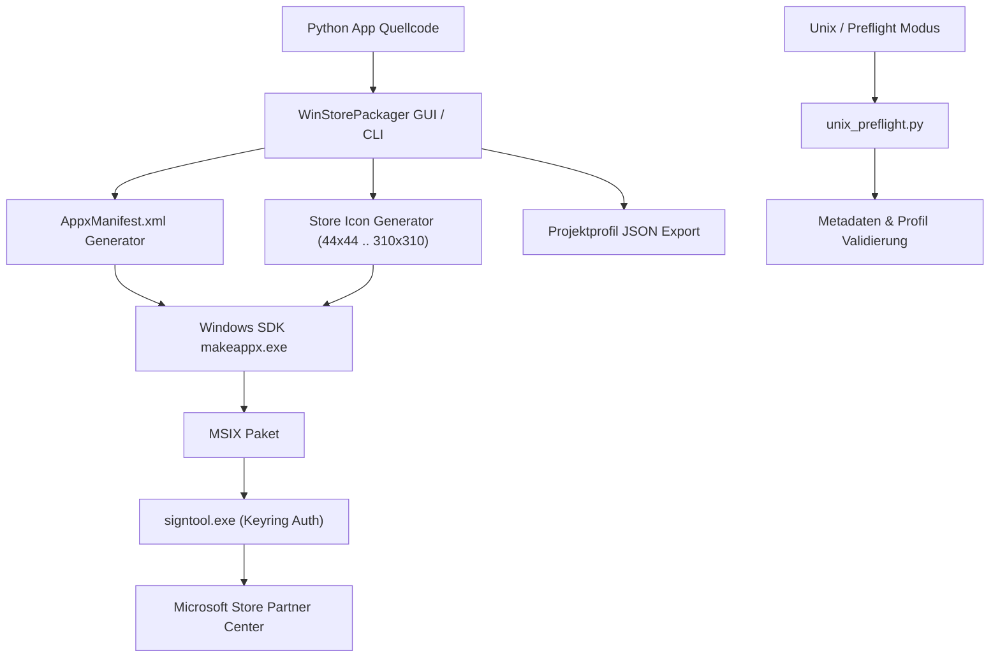

> [English](README.md) | **Deutsch**

# WinStorePackager

WinStorePackager ist ein lokales Windows-GUI für Entwicklerinnen und Entwickler, die Python-Desktop-Apps für den Microsoft Store vorbereiten. Das Tool bündelt die wiederkehrenden Arbeitsschritte rund um AppxManifest-Metadaten, Store-Icons, Screenshots, Projektprofile und MSIX/AppX-Build-Eingaben.

> [!NOTE]
> **Hinweis für KI-Agenten & LLMs**: Die Repository-Struktur und KI-Kontextgrenzen sind in [`llms.txt`](llms.txt) beschrieben. Austauschformate und Metadaten-Schemas finden sich in [`PROJECT_PROFILE_FORMAT.md`](PROJECT_PROFILE_FORMAT.md).


## Schnellstart

| Ziel | Einstieg |
|---|---|
| Python-App für den Microsoft Store vorbereiten | `python WindowsStorePublisher_3.py` oder `START.bat` |
| Store-Metadaten ohne Windows SDK prüfen | `python unix_preflight.py --project-root .` |
| Store-Screenshots neu erzeugen | `python generate_store_screenshots.py` |
| Projektprofil austauschen | `PROJECT_PROFILE_FORMAT.md` |
| WinStorePackager mit sich selbst testen | `winstorepackager-project-v1.json` |
| Datenschutz- und Git-Grenzen prüfen | `PRIVACY_POLICY.md` und `llms.txt` |

## Wofür das Projekt gedacht ist

WinStorePackager richtet sich an kleine Teams und Einzelentwickler, die eine bestehende Python-App nicht jedes Mal in ein Visual-Studio-Projekt umziehen möchten. Das Repo hilft bei:

- AppxManifest-Feldern und Store-Metadaten
- benötigten Icon-Größen für Microsoft-Store-Pakete
- Screenshot-Sammlung für Store-Listings
- lokalem Projektprofil-Export ohne Zertifikats- oder Publisher-Geheimnisse
- SDK-freier Strukturprüfung auf Linux und macOS
- Vorbereitung für `makeappx.exe`, `signtool.exe` und Partner Center

WinStorePackager ersetzt weder das offizielle Microsoft MSIX Packaging Tool noch die eigentliche Einreichung im Partner Center. Es ist ein lokaler Helfer vor dem finalen Build- und Veröffentlichungsprozess.

## Architektur & Paketierungs-Pipeline



## Store-Screenshots

`python generate_store_screenshots.py` erzeugt vier kuratierte Microsoft-Store-Screenshots in `releases/windowsstore/screenshots/`. Die Bilder sind 1920x1080 px groß, verwenden neutrale Demo-Metadaten und zeigen keine echten Partner-Center-Publisher-DNs, Zertifikatspfade, Passwörter, Windows-SDK-Pfade oder privaten Projektpfade.

## Installation

```bash
git clone https://github.com/file-bricks/WinStorePackager.git
cd WinStorePackager
pip install -r requirements.txt
python WindowsStorePublisher_3.py
```

Unter Windows kann alternativ `START.bat` gestartet werden. Wenn ein lokales EXE-Bundle unter `dist\WinStorePackager.exe` vorhanden ist, bevorzugt `START.bat` diese Version.

## Lokale Daten

Publisher-IDs, Zertifikatspfade, Passwörter, Windows-SDK-Pfade, generierte Manifeste, MSIX/AppX-Pakete, WACK-Logs und Release-Bundles gehören nicht ins Git-Repo. Die Projektprofile sind so angelegt, dass sensible lokale Werte ausgelassen werden.

Das Repo enthält ein eigenes Dogfooding-Profil [`winstorepackager-project-v1.json`](winstorepackager-project-v1.json). Es kann in der Desktop-App geladen oder ohne Windows SDK geprüft werden:

```bash
python unix_preflight.py --project-root . --profile-path winstorepackager-project-v1.json
```

Echte Partner-Center-Publisher-Daten, Zertifikate und SDK-Pfade werden erst lokal ergänzt, bevor ein MSIX gebaut oder signiert wird.

## Suchkontext

Nützliche Suchphrasen:

- `WinStorePackager Python Microsoft Store MSIX`
- `file-bricks WinStorePackager`
- `Python AppxManifest generator`
- `local-first MSIX packaging tool`
- `Microsoft Store packaging GUI for Python apps`
- `MSIX packaging tool without Visual Studio`

## Lizenz und Haftung

Dieses Projekt steht unter der [MIT License](LICENSE).

Dieses Projekt ist eine unentgeltliche Open-Source-Schenkung im Sinne der §§ 516 ff. BGB. Die Haftung des Urhebers ist gemäß § 521 BGB auf Vorsatz und grobe Fahrlässigkeit beschränkt. Nutzung auf eigenes Risiko. Keine Wartungszusage, keine Verfügbarkeitsgarantie, keine Gewähr für Fehlerfreiheit oder Eignung für einen bestimmten Zweck.
